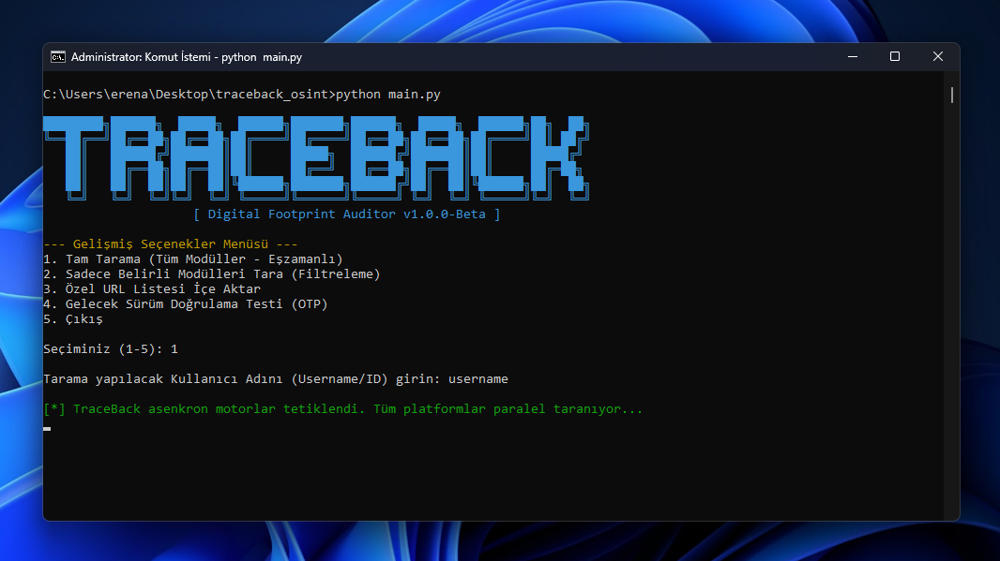

# 🔍 TraceBack: Next-Gen Asynchronous Digital Footprint Auditor

<p align="center">
  
  
  
  
</p>

<p align="center">
  <b>TraceBack</b> is an elite, high-speed OSINT (Open Source Intelligence) framework engineered to map and audit digital identities across global networks, standalone forums, and deep-web social structures using zero-trace behavioral simulation.
</p>

---

## 🎯 Why TraceBack? (Öne Çıkan Özellikler)

> 💡 **Zero Configuration, Maximum Anonymity:**  
> TraceBack **does not require any API keys, tokens, or external proxies**. It operates completely out-of-the-box, ensuring 100% anonymous and stealthy intelligence gathering without leaving a trace or triggering target platform alerts.

---

## ⚡ Core Capabilities (Gelişmiş Yetenekler)

* 🚀 **Parallelized Async Core:** Executes lightning-fast, multi-threaded node routing to audit hundreds of digital platforms simultaneously in milliseconds.
* 🛡️ **Behavioral Identity Cloaking:** Employs organic transaction mimicking to seamlessly bypass strict cloud firewalls, anti-bot perimeters, and tracking grids without triggering alerts.
* 📍 **Deep Metadata Extraction:** Penetrates complex interface layers to harvest micro-intelligence data points, including regional location variables, structural biometrics, and hidden account links.
* 🎭 **Full Spectrum SPA Execution:** Seamlessly processes modern reactive interfaces, dynamic runtime environments, and single-page application systems where traditional scanners completely fail.

---

## 📸 Demo & Terminal Interface

<p align="center">
  
</p>

---

## 🛠️ Deployment (Kurulum)

```bash
# Clone the intelligence engine
git clone https://github.com/erensoen/TraceBack.git

# Enter the project directory
cd TraceBack

# Initialize framework dependencies
pip install -r requirements.txt

# Deploy secure background runtime environment
playwright install
```

---

## 🚀 Execution (Kullanım)

Launch the main interface directly through your security terminal:

```bash
python main.py
```

---

## 🌐 Supported Modules & Platforms

TraceBack targets the core vectors of an individual's digital footprint across 19 specialized operational categories:

### 📱 Core Social & Media Plugins

- [x] Instagram (Anti-Scraping Bypass & Bio Metadata Harvester)
- [x] TikTok (Dynamic DOM Audit & Account Mapping)
- [x] Twitter / X (Stealth Feed & Connected Alias Mapping)
- [x] YouTube (Channel Metadata & Community Post Extraction)

### 🎮 Gaming & Community Matrix

- [x] Steam (Community Profiles & Deep Linked Social Account Auditor)
- [x] Faceit (Competitive Profile Alias Tracking & Connected Steam ID Elicitation)

### 🎧 Audio & Media Streaming Nodes

- [x] Spotify (Deep JSON-LD Parsing & Shared Playlist Leak Analysis)
- [ ] Global & Local Streams (SoundCloud, Last.fm, Deezer, Bandcamp, Fizy, Tidal)

### 💬 Domestic & Global Discussion Boards

- [ ] Yerel Forum Ağları (DonanımHaber, R10.net, Ekşi Sözlük, Technopat, ShiftDelete, THT, WMAracı, Turkmmo)
- [ ] Global Boards (Reddit, Quora, 4chan, StackOverflow, XDA, BlackHatWorld, HackForums, BreachForums, KiwiFarms)

### 🔞 Exclusive / NSFW Risk Verification

- [ ] Adult OSINT Vector (+18 Websites)

### 🔍 Search Engine Intelligence & Recon

- [ ] Automated Dorking Core (Advanced query structures for Google, DuckDuckGo, Bing, Yandex, Yahoo, Baidu)

### 💻 Developer Workspaces & Repositories

- [ ] Code Repositories (GitHub, GitLab, Bitbucket, CodePen, Replit, Docker Hub)
- [ ] Professional Networks (LinkedIn, Corporate Bug Bounty Handles like HackerOne & Bugcrowd)

### 💰 Web3 FinTech & Blockchain Nodes

- [ ] Ledger & Asset Auditing (Bitcoin Wallet Verification, Ethereum Transactions, OpenSea NFT Profiles, Etherscan, Solscan)

### 📦 Commercial Footprints & E-Commerce

- [ ] Marketplace Footprints (Amazon Wishlists, eBay Sellers, AliExpress Reviews, Shopify Nodes)
- [ ] Local Commercial Hubs (Sahibinden Classifieds, Letgo, Dolap, Trendyol, Hepsiburada, N11)

### 📁 Leaked Pastes & Breach Intelligence

- [ ] Exposed Text Repositories (Pastebin, Ghostbin, Rentry, Paste.ee, JustPaste.it, Hastebin)
- [ ] Credential Leak Auditing (HaveIBeenPwned Matrix, LeakCheck Logs, DeHashed Data, IntelX)

### ☁️ Archival Recon & Cloud Infrastructure

- [ ] Cloud Storage Traces (Mega.nz Public Shares, Scribd Documents, SlideShare Presentations, Dropbox Paths, Yandex Disk)
- [ ] Historical Internet Snapshots (Wayback Machine Deep Parsing, Archive.is Time-Travel Audits, Google Cache Nodes)
- [ ] Academic & Corporate Registries (ResearchGate, Academia.edu, ORCID, YÖK Tez, Crunchbase, OpenCorporates)

---

## 🗺️ Project Roadmap

- [x] High-Speed Asynchronous Extraction Architecture
- [x] Stealth Human Interaction Emulation Engine
- [x] Structural Integration of Massive Global/Domestic Forums & Specialized Leaks Matrix
- [x] Dynamic Simetric Status HUD Execution Environment
- [ ] Phase 3: Expansion of Supported Social Media & Dynamic Membership Networks
- [ ] Phase 5: Multi-Vector Queries (Targeted Email & Communication Node Hunting)
- [ ] Phase 6: Global Localization Package [TR] / [EN]

---

## 📜 System License & Legal

This framework is protected under the AGPL-3.0 License.

**Disclaimer:** TraceBack is strictly intended for authorized digital footprint audits, defensive security research, and academic intelligence compilation. The architect accepts absolutely no liability for infrastructure misuse or terms of service violations.
